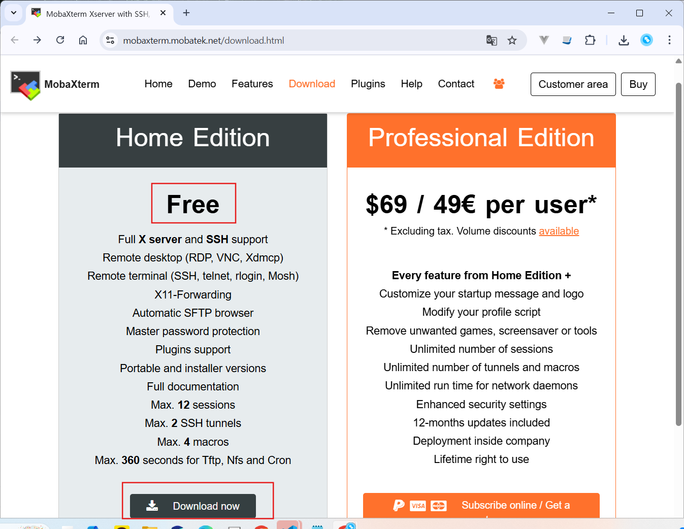
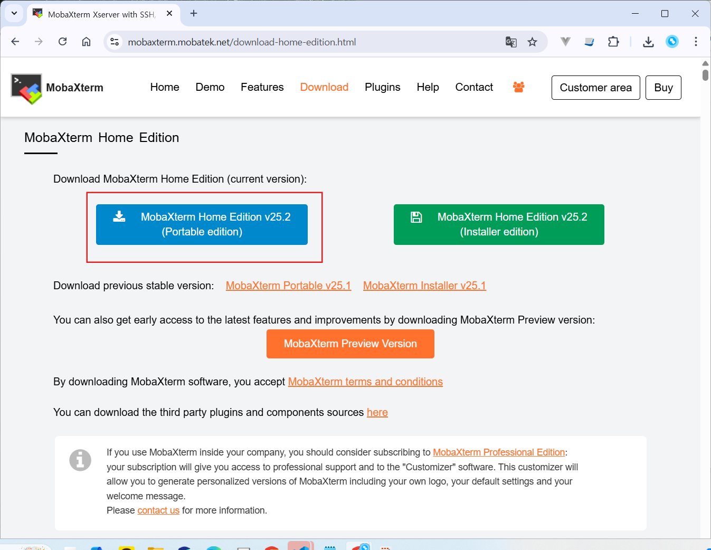
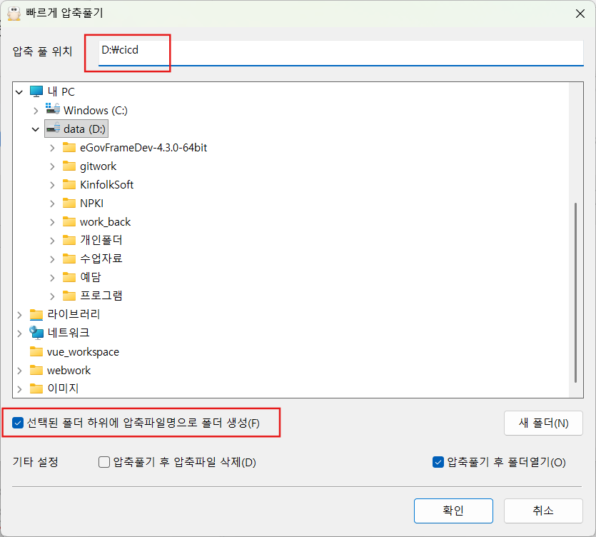

## SSH(SecureSHell) 주요 기능

- 원격 접속 및 제어: 네트워크 상의 다른 컴퓨터에 로그인하여 명령을 실행하고 시스템을 제어할 수 있습니다.
- 보안 통신: 클라이언트와 서버 간의 모든 통신을 암호화하여 중간에서 데이터를 가로채더라도 내용을 알아볼 수 없습니다.
- 파일 전송: 안전하게 파일을 전송하는 기능도 제공하며, SCP와 같은 명령어를 통해 사용됩니다.
- 인증: 비밀번호 방식과 공개 키/개인 키 방식을 통해 사용자를 인증합니다.

## MobaXterm 설치: SSH 클라이언트

  

다운받은 MobaXterm_Portable_v25.2.zip 파일을 `D:\cicd_work` 폴더에 압축풀기 (폴더생성을 체크하기)

EC2 인스턴스에 SSH 연결

## 개인 키와 공개 키

보통 CSP에서 제공하는 서버의 경우 (예를 들면 AWS EC2) 접속할 클라이언트의 공개키와 개인키를 미리 생성하여 서버의 authorized_keys에 공개키를 넣어두고 개인키만 알려주게 됩니다. 그러면 그 개인키를 이용하여 서버에 접속할 수 있겠죠

공개키(id_rsa_pub)의 내용을 서버의. ssh/authorized_keys에 복사합니다.

개인키와 공개키의 원리

1. 키 쌍 생성: AWS에서 키 페어를 생성하면 한 쌍의 공개키와 개인키가 생성됩니다.
2. 공개키 배포: 사용자는 생성된 공개키를 AWS EC2 인스턴스에 등록하고, 개인키는 자신의 컴퓨터에 안전하게 보관합니다.
3. 인증 시도: 사용자가 개인키를 가지고 인스턴스에 SSH로 접속을 시도합니다.
4. 신원 확인: 인스턴스는 사용자로부터 받은 개인키와 인스턴스에 저장된 공개키를 비교하여 사용자의 신원을 확인합니다.
5. 안전한 통신: 사용자가 인증되면, 개인키와 공개키 쌍을 이용하여 데이터를 암호화하는 안전한 통신 세션이 설정됩니다.

### 사용자 인증과정

사용자가 서버에 접근하고자 할 때 서버관점, 인가된 사용자인지 확인하는 과정입니다..

1. 서버인증과정과 절차가 유사하지만 반대로 진행
2. 클라이언트가 비대칭키인 개인키와 공개키를 생성함
3. 클라이언트가 공개키를 서버에 전달
4. 서버는. ssh/authorized_keys에 클라이언트의 공개키를 저장
5. 서버에서는 난수를 발생시킨 후 hash값으로 저장
6. 공개키를 이용하여 발생시킨 난수값을 암호화
7. 암호화된 난수값을 클라이언트에 전달
8. 클라이언트는 전달받은 난수값을 개인키를 이용하여 복호화
9. 복호화된 난수값을 hash값으로 변환
10. 변환된 hash값을 다시 서버에 전달
11. 서버는 클라이언트로부터 받은 hash값이 본인이 전달했던 난수값의 hash값과 같은지 비교
12. 비교 후 동일하다면 사용자 인증 성공
