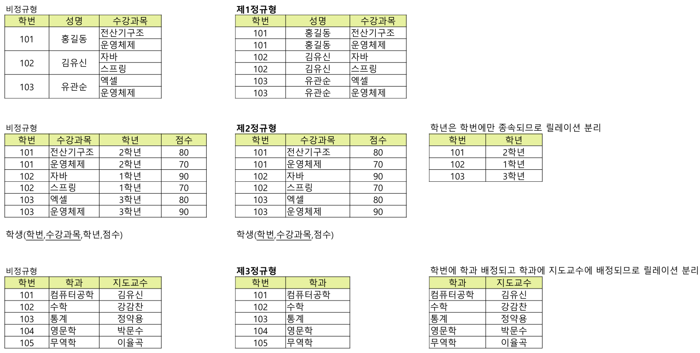
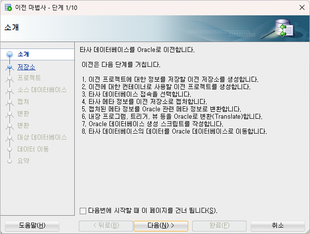

## 개념 정리

### RDBMS 기본 용어

- 속성(Attribute): 개체 정보의 특성에 대한 이름
- 도메인(Domain): 한 속성에 입력되는 실제 원자 값들의 범위
- 튜플(Tuple): 속성들에 실제 입력된 값들의 집합
- `릴레이션`(Relation): 데이터 간에 나타내는 표 자체. 릴레이션 스키마와 릴레이션 어커런스가 결합된 명칭
- 릴레이션 스키마(Relation Schema): 하나 이상의 속성을 합쳐 정의하는 이름
- 릴레이션 어커런스(Relation Occurrence): = 인스턴스, 실제 입력된 튜플들의 집합으로 시간에 따라 변화된다.
- 차수(Degree): 하나의 릴레이션에서 정의왼 속성의 개수(컬럼의 수)
- 카디널리티(Cardinality): 하나의 릴레이션에 형성된 튜플의 개수(레코드 수)
- 널(NULL): 속성 값이 비어 있는 상태

객체 어커런스: 데이터 자체. 독립적으로 존재 가능. 실제 데이터
릴레이션 어커런스: 데이터 간 연결. 두 객체 간의 관계 한 건

### RDBMS 키

- 후보키: 유일성 + 최소성, 튜플을 구분할 수 있는 키
- 기본키: 후보키를 중 데이터베이스의 설계자에 의해서 튜플 구별을 위해 선택된 한 개의 키
- 대체키: 후보키 중에서 기본키를 제외한 모든 키
- 외래키: 참조하는 키
- 슈퍼키: 튜플을 식별하기 위한 두 개 이상의 속성들의 집합으로 이루어진 키, 유일성은 만족시키지만 최소성은 만족 안됨.

## 모델링

개념 모델링

- 개체타입, 기본속성, 관계를 ERD 로 설계
- 객체: 업무에서 중요한 대상. 명사 중심으로 정의.
- `릴레이션십`(relationship): 객체 간의 업무 관계. 동사 형태

논리 모델링

- 컴퓨터에 저장할 수 있는 논리적 구조로 변환
- 정규화: 릴레이션이 테이블 구조로 변환(N:M)
- 릴레이션은 FK + 연결 테이블 <-- 개념 모델의 realtionship이 변화됨

물리 모델링

- DBMS 벤더에 따라 데이터베이스 생성을 위한 물리 구조로 변환
- 데이터 타입 결정
- 인덱스 생성
- 성능 고려
-

| 단계       | 객체(Entity)   | 릴레이션(Relationship) | 설명                                              |
| :--------- | :------------- | :--------------------- | :------------------------------------------------ |
| 개념(추상) | 업무대상(개체) | 업무관계               | 객체(동사),릴레이션(명사), 카디널리티만 표현      |
| 논리(구체) | 엔티티+속성    | FK/연결 엔티티         | 속성, 기본키, 포린키 정의. 정규화                 |
| 물리(구현) | 테이블         | FK + 제약조건          | DB에 실제 구현. 데이터타입, 인덱스 생성. 반정규화 |

```
relationship은 개념모델에서 객체간의 관계를 선으로 표현
relation는 관계형DB 논리 모델에서 테이블을 의미

relationship : @OneToMany @OneToOne
relation : @Entity
```

### 개체와 속성

객체

속성 특성에 따른 분류

- 기본속성: 업무 분석으로 정의된 속성
- 설계속성: 원래 업무에는 존재하지 않지만 설계를 하면서 도출하는 속성
- 파생속성: 다른 속성으로부터 계산이나 변형되어 생성되는 속성. 계산값

식별자

- 인조식별자

삭별자 구분

- 주 식별자와 보조 식별자
- 내부 식별자와 외부 식별자
- 단일 식별자와 복합 식별자

### 논리모델링

### 슈퍼타입과 서브타입

- 특수화(Specialization): 하향식. 여러 개의 하위 레빌 개체 타입으로 분리하려 표현
- 일반화(Generalization): 상향식. 여러 개체 타입의 공통적인 특성을 가진 상위 객체 타입으로 표현

#### 정규화

- 하나의 릴레이션에 하나의 의미만 존재할 수 있도록 릴레이션을 분해해나가는 과정
- 정규형(Normal form)이란 특정 조건에 만족하는 릴레이션 스키마의 형태를 의미
- 기본 정규형에는 1NF, 2NF, 3NF, BCNF(Boyce-Codd NF)가 있고 고급 정규형에는 4NF, 5NF이 있다.
- 정규화 수준이 높으면 물리적 접근이 복잡해지고 조인이 발생

정규화 과정

```
비정규형
  ↓      도메인을 원자값만 갖도록 분해
  1NF
  ↓      부분함수 종속을 제거
  2NF
  ↓      이행적 함수 종속을 제거
  3NF
  ↓      결정자 후보키가 아닌 함수 종속을 제거
  BCNF
```

제1정규형  
모든 속성은 반드시 하나의 값을 가져야 한다. 릴레이션의 속한 모든 도메인 혹은 속성의 원자 값만으로 되어 있다면 제1정규형에 속한다.

제2정규형

- 제1정규형에 속하고 기본키에 속하지 않는 모든 속성들이 기본키에 완전 함수 종속이면 제2정규형에 속한다.
- 학번과 수간과목이 기본키인 경우에 점수는 완전종속이지만 학년은 학번에만 종속되는 부분함수종속이다. -> 제2정규형 대상임

제3정규형

- 기본키에 속하지 않는 모든 속성이 기본키에 이행적 함수 종속이 아니면 제3정규형에 속한다.
- 학생, 학과, 학번이 있는 경우 학생이 학과에 소속되고 학과별로 지도교수가 배정되기 때문에 이행적 함수 종속이다. -> 이행적함수 종속을 제거하여 두 개의 릴레이션으로 만듬( 학번,학과), (학과, 지도교수)



## mysql -> oracle 마이그레이션

1. mysql connector/j 다운로드

```
https://dev.mysql.com/downloads/connector/j/
```

2. oracle sql developer에 라이브러리 등록  
   도구 메뉴 → 환경설정 → 데이터베이스 → 타사 JDBC 드라이버  
   

3. mysql 접속  
   

   
