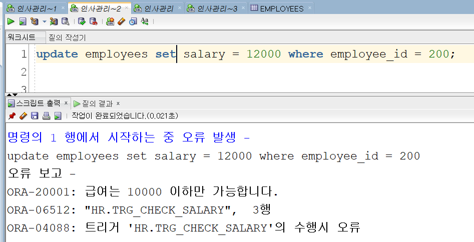

# 트리거

## ■ 트리거란

특정 이벤트(INSERT, UPDATE, DELETE, DDL, LOGON 등)가 발생했을 때 자동으로 실행되는 저장 프로시저

## ■ 실무 사용 사례

### 1. 감사 로그 (Audit Logging)

- 직원 정보 변경 시 누가 언제 무엇을 바꿨는지 기록
- 전사 시스템에서 추적성 확보

### 2. 데이터 무결성 보강

- 급여 상한/하한 제한
- 주문 발생 시 재고 차감

### 3. 자동화 처리

- 입력과 동시에 시퀀스 번호/타임스탬프 부여
- 업무 규칙 강제

### 4. DDL 트리거로 보안 강화

- DROP TABLE 방지 로그
- 특정 유저가 테이블 구조 변경 시 관리자 알림

## ■ 트리거 종류

### 1. DML 트리거

- INSERT, UPDATE, DELETE 발생 시 실행
- 예: 주문 테이블에 데이터 입력 시 자동으로 로그 테이블에 기록 -시점: BEFORE / AFTER

### 2. DDL 트리거

- CREATE, ALTER, DROP 같은 DDL 문 실행 시 실행
- 예: 누군가 테이블을 DROP 하려고 하면 기록 남김

### 3. DB 이벤트 트리거

- LOGON, LOGOFF, STARTUP, SHUTDOWN 같은 DB 이벤트 발생 시 실행
- 예: 특정 계정이 접속할 때마다 알림 기록

## ■ 기본문법

```sql
CREATE OR REPLACE TRIGGER trigger_name
BEFORE INSERT OR UPDATE OR DELETE ON table_name
FOR EACH ROW
BEGIN
   -- 트리거가 실행할 코드
   DBMS_OUTPUT.PUT_LINE('트리거 동작함');
END;
```

### 시점 (BEFORE / AFTER)

- BEFORE : SQL 실행 전에 동작
- AFTER : SQL 실행 후에 동작

### FOR EACH ROW :

- 행 단위 트리거 (없으면 문장 단위 트리거)

### :OLD / :NEW 의사 레코드

- 트리거에서 변경 전/후 데이터를 참조 가능
- INSERT → :NEW만 존재
- DELETE → :OLD만 존재
- UPDATE → :OLD, :NEW 모두 존재

## ■ 실습

### 1. employees 테이블 급여 변경 -> 로그 기록

```sql
CREATE OR REPLACE TRIGGER trg_update_salary
BEFORE UPDATE OF salary ON employees
FOR EACH ROW
BEGIN
   DBMS_OUTPUT.PUT_LINE('변경 전: ' || :OLD.salary);
   DBMS_OUTPUT.PUT_LINE('변경 후: ' || :NEW.salary);
END;

```

```
update employees set salary = 2000 where employee_id = 200;
```


### 2. 데이터 무결성 실습(급여 상한 제한)

트리거 생성

```sql
CREATE OR REPLACE TRIGGER trg_check_salary
BEFORE INSERT OR UPDATE OF salary ON employees
FOR EACH ROW
BEGIN
   IF :NEW.salary > 10000 THEN
      RAISE_APPLICATION_ERROR(-20001, '급여는 10000 이하만 가능합니다.');
   END IF;
END;
```

실습

```sql
update employees set salary = 12000 where employee_id = 200;
```



### 3. 자동 로그 기록 실습(누가 언제 무엇을 바꿨는지 기록)

트리거 생성

```sql
CREATE TABLE emp_log (
   log_id NUMBER PRIMARY KEY,
   emp_id NUMBER,
   action VARCHAR2(20),
   log_date DATE DEFAULT SYSDATE
);

CREATE SEQUENCE emp_log_seq;

CREATE OR REPLACE TRIGGER trg_emp_log
AFTER INSERT OR DELETE ON employees
FOR EACH ROW
BEGIN
   IF INSERTING THEN
      INSERT INTO emp_log VALUES (emp_log_seq.NEXTVAL, :NEW.employee_id, 'INSERT', SYSDATE);
   ELSIF DELETING THEN
      INSERT INTO emp_log VALUES (emp_log_seq.NEXTVAL, :OLD.employee_id, 'DELETE', SYSDATE);
   END IF;
END;
```

실습

```sql
insert into employees ( EMPLOYEE_ID,LAST_NAME,EMAIL,HIRE_DATE,JOB_ID)
            values   ( 300,'choi', 'a@a.a', sysdate, 'IT_PROG');

delete employees where employee_id = 300;

select * from emp_log;
```


### 주문/재고 관리 시나리오

주문/재고 테이블 생성

```sql
-- 상품 테이블
CREATE TABLE products (
    product_id   NUMBER PRIMARY KEY,
    product_name VARCHAR2(100),
    price        NUMBER,
    stock        NUMBER
);

INSERT INTO products VALUES (101, '노트북', 1500, 10);
INSERT INTO products VALUES (102, '모니터', 300, 5);
INSERT INTO products VALUES (103, '키보드', 50, 20);

COMMIT;

-- 주문 마스터 테이블
CREATE TABLE orders (
    order_id     NUMBER PRIMARY KEY,
    customer_id  NUMBER,
    order_date   DATE DEFAULT SYSDATE,
    order_total  NUMBER DEFAULT 0  -- 합계 저장
);

CREATE SEQUENCE orders_seq;

-- 주문 상세 테이블
CREATE TABLE order_items (
    item_id    NUMBER PRIMARY KEY,
    order_id   NUMBER REFERENCES orders(order_id),
    product_id NUMBER REFERENCES products(product_id),
    quantity   NUMBER,
    line_total NUMBER  -- 수량 * 단가 저장
);

CREATE SEQUENCE order_items_seq;

```

주문 마스터 (orders) + 주문 상세 (order_items) 로 나뉘고, 주문 상세에 데이터가 추가되면 주문 마스터의 총 금액(order_total) 을 자동으로 갱신하는 트리거 생성

```sql
-- 주문 상세 입력 시 라인 금액 계산 및 주문 합계 반영
CREATE OR REPLACE TRIGGER trg_order_item_insert
AFTER INSERT ON order_items
FOR EACH ROW
DECLARE
    v_price NUMBER;
    v_stock NUMBER;
BEGIN
    -- 상품 가격 가져오기
    SELECT price INTO v_price
    FROM products
    WHERE product_id = :NEW.product_id;

    -- line_total 계산 (상품가격 * 수량)
    UPDATE order_items
    SET line_total = v_price * :NEW.quantity
    WHERE item_id = :NEW.item_id;

    -- 주문 합계 업데이트
    UPDATE orders
    SET order_total = NVL(order_total,0) + (v_price * :NEW.quantity)
    WHERE order_id = :NEW.order_id;

    -- 재고 차감
    UPDATE products
    SET stock = stock - :NEW.quantity
    WHERE product_id = :NEW.product_id;
    SELECT stock into v_stock FROM products WHERE product_id = :NEW.product_id;
    IF v_stock < 0 THEN
        RAISE_APPLICATION_ERROR(-20003, '재고 부족');
    END IF;
END;
```

테스트

```sql
-- 주문 생성
INSERT INTO orders VALUES (orders_seq.NEXTVAL, 1001, SYSDATE, 0);

-- 주문 상세 추가
INSERT INTO order_items VALUES (order_items_seq.NEXTVAL, 1, 101, 2, NULL); -- 노트북 2개
INSERT INTO order_items VALUES (order_items_seq.NEXTVAL, 1, 103, 5, NULL); -- 키보드 5개

-- 확인
SELECT * FROM orders;       -- order_total 자동 반영됨
SELECT * FROM order_items;  -- line_total 계산됨
SELECT * FROM products;     -- stock 차감됨
```

mutation error 'ORA-04091: table HR.ORDER_ITEMS is mutating, trigger/function may not see it' 발생함  
Oracle은 행 단위 트리거(FOR EACH ROW) 실행 중에 그 테이블을 직접 SELECT/UPDATE 하는 걸 금지합니다.


트리거 안에서 자기 자신(order_items)을 다시 수정하지 말고 :NEW 값을 변경함

```sql
CREATE OR REPLACE TRIGGER trg_order_item_insert
BEFORE INSERT ON order_items
FOR EACH ROW
DECLARE
    v_price NUMBER;
BEGIN
    -- 상품 가격 가져오기
    SELECT price INTO v_price
    FROM products
    WHERE product_id = :NEW.product_id;

    -- line_total 값 직접 세팅
    :NEW.line_total := v_price * :NEW.quantity;
END;
/
CREATE OR REPLACE TRIGGER trg_order_item_after
AFTER INSERT ON order_items
FOR EACH ROW
DECLARE
    v_stock number;
BEGIN
    -- 주문 합계 업데이트
    UPDATE orders
    SET order_total = NVL(order_total,0) + :NEW.line_total
    WHERE order_id = :NEW.order_id;

    -- 재고 차감
    UPDATE products
    SET stock = stock - :NEW.quantity
    WHERE product_id = :NEW.product_id;

    SELECT stock into v_stock FROM products WHERE product_id = :NEW.product_id;
    IF v_stock < 0 THEN
        RAISE_APPLICATION_ERROR(-20003, '재고 부족');
    END IF;
END;
```

update 외에도 insert, delete 실행에 대한 트리거도 필요함 -> 문장 레벨에서 detail의 합계를 구해서 order에 넣는 방법도 있음.

```sql
create or replace NONEDITIONABLE TRIGGER trg_order_item_after
AFTER INSERT ON order_items
FOR EACH ROW
DECLARE
    v_stock number;
BEGIN
    -- 주문 합계 업데이트
    UPDATE orders
    SET order_total = NVL(order_total,0) + :NEW.line_total
    WHERE order_id = :NEW.order_id;

    -- 재고 차감
    UPDATE products
    SET stock = stock - :NEW.quantity
    WHERE product_id = :NEW.product_id;

    SELECT stock into v_stock FROM products WHERE product_id = :NEW.product_id;
    IF v_stock < 0 THEN
        RAISE_APPLICATION_ERROR(-20003, '재고 부족');
    END IF;
END;
```
